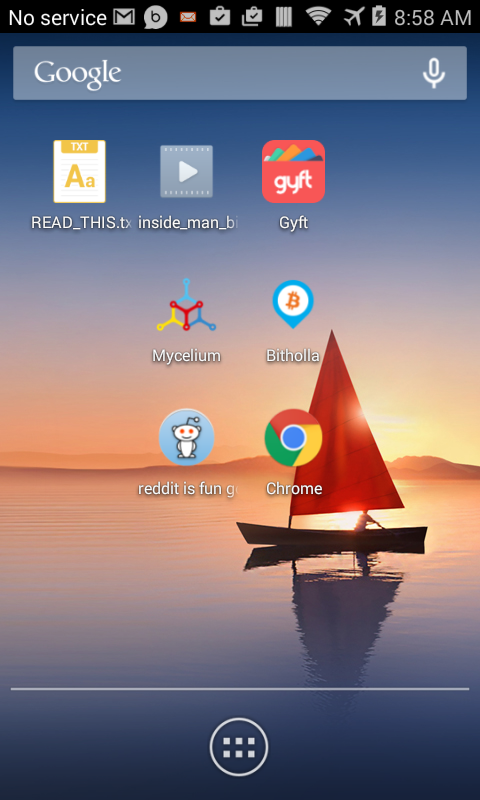
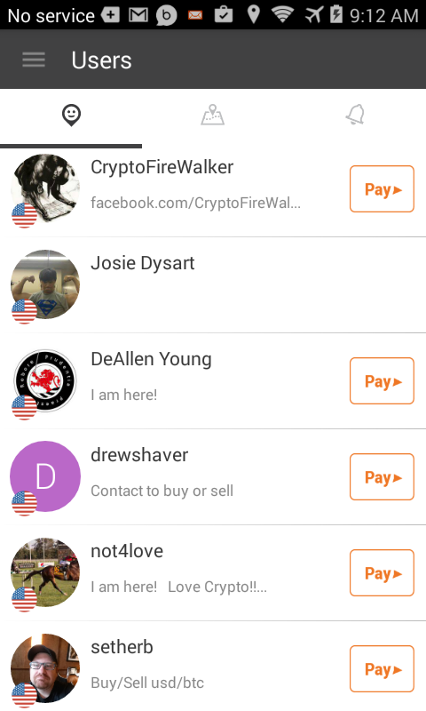

# indigent-android-bitcoin

A guide to setting up a stock android device as a mobile bitcoin appliance for people with few resources. The initial target is to provide a smooth process for panhandlers to receive bitcoin tips.

## Tip4Commit

This project participates in [Tip4Commit](https://tip4commit.com/github/secret-bitcoin-login/indigent-android-bitcoin). Feel free to submit pull requests, or contribute to the project by donating to [1JmQ9va35LJsmw8ob7seXDnz5Jzfo42NqC](bitcoin://1JmQ9va35LJsmw8ob7seXDnz5Jzfo42NqC)

## The scenario

Bitcoin has huge potential with people of little means to conduct personal banking and exchange. The barriers to entry have been helping those in need understand bitcoin and finding a way to help them earn/receive bitcoin. If givers could easily view those in need, it would be easier to provide tips, wages, and gifts just by looking at their names on the screen. The bitholla app adds this functionality by providing a geolocated list of persons.

## The tools

Begin with an android device that has been factory reset and cleared of any carrier bloatware. I have added links to the files, but I encourage you to install using the Google Play store so the end user will get updates.

* [READ_THIS.txt](https://raw.githubusercontent.com/secret-bitcoin-login/indigent-android-bitcoin/master/READ_THIS.txt) - an introduction to the phone that will be linked on the home screen
* [Bitholla](https://play.google.com/store/apps/details?id=com.me.bit.bitme) - Bitholla is the geolocation send/receive app (not a wallet)
* [Reddit browser](https://play.google.com/store/apps/details?id=com.andrewshu.android.reddit) - Reddit is fun to develop community
* [Gyft](https://play.google.com/store/apps/details?id=com.gyft.android) - Practical use of bitcoin
* [Mycelium Wallet](https://play.google.com/store/apps/details?id=com.mycelium.wallet) - The primary bitcoin wallet on the device
* [Circle Wallet](https://play.google.com/store/apps/details?id=com.circle.android) - Some people will want to link to banking
* Introduction Video - Morgan Spurlock - Inside Man - Bitcoin. Source this on your own, or choose an alternative.

## Device Setup

1. Turn the device on airplane mode but enable wifi.
2. Create a google account with a memorable name and secure password. I suggest making a physical copy of this username and password and somehow pasting it/taping to to the outside of the device.
3. Set up a mycelium account. Make physical backup of the seed for the end user and store in with the device.
3. Set up a Bitholla account, in the username, append _ind to any name you choose, this will help others know that the phone is requesting indigent donations. Use the mycelium account to fund the bitholla account. (Bitholla is NOT a wallet, it is a convenience layer.)
4. Set up a reddit account using the same username. Unsubscribe from the defaults, and subscribe to /r/btc and your local reddits.
5. Set up a Gyft account and connect it to the G+ account.

## About Bitholla

This github has absolutely no affiliation with bitholla other than product interest. I have considered asking those in need to set up a bitholla account with a suffix "_ind" to indicate that they are indigent and accepting donations. This is a screenshot of the giving interface:

